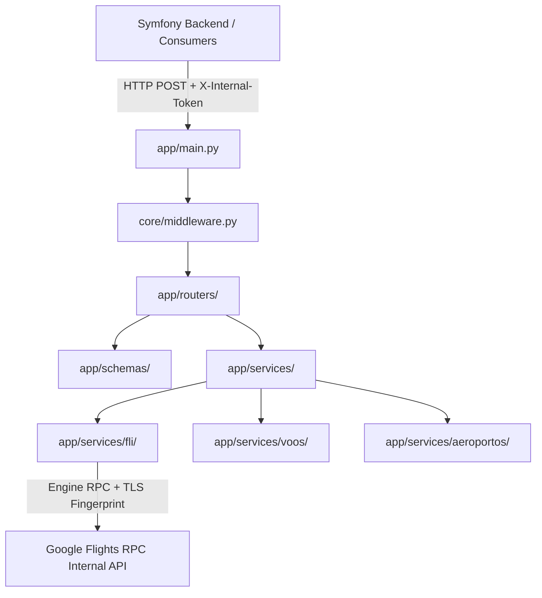

# 🏗️ Arquitetura do Microsserviço de Voos

## 1. Visão Geral da Arquitetura

O `voobarato-flights-api` atua como uma ponte de alta performance entre a aplicação principal (Symfony / PHP) e a infraestrutura interna do Google Flights.

## 2. Decisões de Design

### Substituto do Web Scraping (`fast-flights` -> `fli`)
O mecanismo anterior baseava-se em navegar em instâncias do Chromium ou ler HTML estático. Isso apresentava diversos gargalos:
- **Fragilidade Layout/DOM**: Qualquer alteração em classes CSS do Google Flights quebrava os scrapers.
- **Alto Custo de CPU e RAM**: Instâncias de navegadores headless consomem recursos significativos.
- **Campos Incompletos**: Dados como modelo da aeronave, bagagens incluídas e conexões eram difíceis de extrair confiavelmente do HTML.

O pacote `fli` se comunica diretamente com o endpoint RPC interno do Google Flights via cliente de rede `curl_cffi`, simulando o fingerprint TLS de navegadores reais (evitando captchas e bloqueios de IP).

### Padrão de Projeto no Service Layer
O acoplamento com a biblioteca `fli` fica isolado em `app/services/fli/` e `app/services/voos/`. A aplicação FastAPI interage apenas com DTOs Pydantic em português. Domínios separados:

| Pacote | Responsabilidade |
|---|---|
| `services/fli/` | Adaptadores: enums, resolução de IATA |
| `services/voos/` | Busca, mapeamento de ofertas, cache, URL Google Flights |
| `services/aeroportos/` | Catálogo, autocomplete, resolução cidade→IATA |

### Ofertas com conexão
Com `maximo_escalas: "ANY"`, o Google Flights resolve automaticamente rotas sem voo direto. A API enriquece cada oferta com `direto`, `com_conexao`, `rota_iata` (IATA + cidade) e `aeroportos_conexao` — sem lógica extra de roteamento no backend.

## 3. Estratégia de Resolução do Bug de Janela vs Data Exata

O bug histórico ("Preço da oferta R$303 exibido em dia cuja passagem custava R$3.853") ocorria porque o scraper antigo retornava o menor preço encontrado em uma busca por intervalo de datas sem vincular a qual dia específico aquele valor pertencia.

No novo modelo:
1. `/api/v1/buscar/janela` é usada para mapear o calendário de preços.
2. Cada item em `por_data` vincula estritamente `data` e `preco`.
3. As datas mais baratas são opcionalmente expandidas via `expandir_top`, gerando objetos `OfertaVooSaida` completos com percursos, horários e companhia aérea responsável.

## 4. Documentação complementar

- [`DOCUMENTACAO_TECNICA.md`](./DOCUMENTACAO_TECNICA.md) — estrutura de pastas e arquivos
- [`API.md`](./API.md) — contratos REST e exemplos
