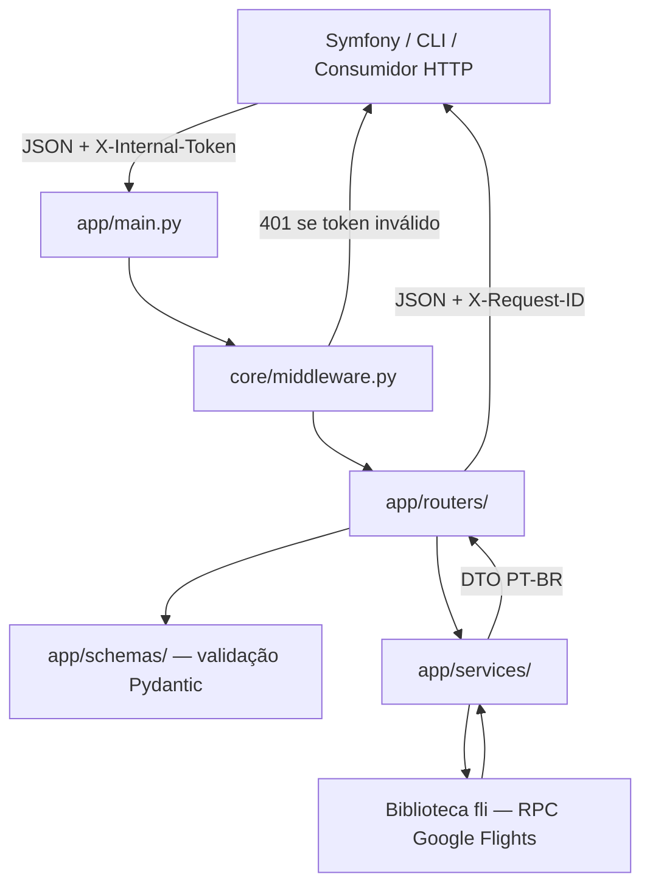

# Documentação Técnica — voobarato-flights-api

Microsserviço HTTP em **Python 3.10+ / FastAPI** que expõe busca de voos e consulta de aeroportos para o ecossistema Voo Barato (Symfony). A comunicação com o Google Flights é feita via biblioteca [`fli`](https://github.com/punitarani/fli) (`pip install flights==0.9.0`), sem scraping de HTML.

---

## 1. Funcionalidade geral

| Capacidade | Descrição |
|---|---|
| **Health check** | Endpoint público `/saude` para monitoramento (Docker, Kubernetes, load balancers). |
| **Busca pontual** | `POST /api/v1/buscar` — voos em data exata (ida ou ida e volta), com ofertas completas. |
| **Busca por janela** | `POST /api/v1/buscar/janela` — preço mínimo por dia em um intervalo; opcionalmente expande as datas mais baratas. |
| **Busca por localidade** | `POST /api/v1/buscar/por-local` — resolve cidade/estado/IATA, testa combinações em paralelo e retorna **todas as ofertas** ordenadas por preço. |
| **Catálogo de aeroportos** | `GET /api/v1/aeroportos` — autocomplete e filtros; `GET /api/v1/aeroportos/{iata}` — detalhe por código. |

**Contrato da API:** campos JSON, rotas e DTOs em **português (PT-BR)**. Horários de voo (`data_hora_partida`, `data_hora_chegada`) são **naive** (horário local do aeroporto, sem timezone/`Z`).

---

## 2. Fluxo de uma requisição



1. **Middleware** injeta `X-Request-ID` e valida `X-Internal-Token` (exceto `/saude`).
2. **Router** recebe o body/query, valida com Pydantic e delega ao service.
3. **Service** traduz parâmetros PT-BR → tipos `fli`, executa a busca e mapeia o resultado de volta.
4. **Exception handler** (`core/exceptions.py`) padroniza respostas de erro HTTP com log e correlation ID.

---

## 3. Estrutura de diretórios

```
voo-flights/
├── app/                    # Código-fonte da API
│   ├── core/               # Infraestrutura transversal
│   ├── schemas/            # Contratos de entrada e saída (Pydantic)
│   ├── routers/            # Endpoints HTTP (camada fina)
│   ├── services/           # Regras de negócio e integração fli
│   └── main.py             # Bootstrap FastAPI
├── cli/                    # Scripts shell para testes manuais
├── docs/                   # Documentação
├── Dockerfile
├── docker-compose.yml
├── Makefile
├── pyproject.toml          # Configuração Ruff
├── requirements.txt        # Dependências de produção
└── requirements-dev.txt    # Dependências de desenvolvimento (Ruff)
```

---

## 4. Diretório `app/`

### 4.1. `app/main.py`

Ponto de entrada da aplicação Uvicorn (`app.main:app`).

- Instancia `FastAPI` com nome e versão de `configuracoes`.
- Registra middleware de rastreamento/autenticação.
- Registra handler global de `HTTPException`.
- Inclui os roteadores: `saude`, `buscar`, `aeroportos`.

### 4.2. `app/core/` — infraestrutura

| Arquivo | Responsabilidade |
|---|---|
| `config.py` | Lê variáveis de ambiente (`FLIGHTS_*`, `TOKEN_INTERNO`, timeouts). Expõe singleton `configuracoes`. |
| `middleware.py` | Gera/propaga `X-Request-ID`; exige `X-Internal-Token` nas rotas protegidas quando configurado. |
| `exceptions.py` | Handler de `HTTPException`: log estruturado + JSON `{"error": ...}` + header de correlação. |

### 4.3. `app/schemas/` — contratos da API

Validação e serialização com **Pydantic v2**. Separação por domínio:

| Arquivo | Conteúdo |
|---|---|
| `aeroportos.py` | `AeroportoSaida`, `RespostaListaAeroportos` |
| `voos.py` | `TipoLocal`, requisições (`RequisicaoBusca*`), respostas, `OfertaVooSaida`, `ParadaRotaSaida`, `TrechoVooSaida`, `OfertaBuscaPorLocalSaida` |

Os routers importam diretamente destes módulos; não há lógica de negócio aqui.

### 4.4. `app/routers/` — camada HTTP

Camada **fina**: apenas define rotas, tags OpenAPI e delega ao service.

| Arquivo | Prefixo | Endpoints |
|---|---|---|
| `saude.py` | — | `GET /saude` |
| `buscar.py` | `/api/v1` | `POST /buscar`, `/buscar/janela`, `/buscar/por-local` |
| `aeroportos.py` | `/api/v1` | `GET /aeroportos`, `/aeroportos/{codigo_iata}` |

Documentação interativa: `http://127.0.0.1:12000/docs` (Swagger).

### 4.5. `app/services/fli/` — adaptação da biblioteca upstream

Isola o acoplamento com o pacote `fli`. Se a API do Google Flights mudar, a alteração concentra-se aqui e nos mappers de voos.

| Arquivo | Responsabilidade |
|---|---|
| `adaptadores.py` | Mapas `MAPA_MAX_ESCALAS`, `MAPA_CLASSE`, `MAPA_ORDENACAO` (strings da API → enums `fli`); `resolver_aeroporto(codigo)` valida IATA contra o enum `Airport`. |

### 4.6. `app/services/aeroportos/` — domínio de aeroportos

| Arquivo | Responsabilidade |
|---|---|
| `dados.py` | `ESTADOS_BRASIL` (sigla ↔ nome) e `MAPEAMENTO_AEROPORTOS` — metadados enriquecidos (cidade, estado, país, `principal`, `descricao_curta`) para aeroportos relevantes. |
| `texto.py` | Normalização de texto, resolução de UF, montagem de `AeroportoSaida`, `obter_cidade_por_iata()`. |
| `indice.py` | Pré-computa `INDICE_AEROPORTOS` no startup a partir do enum `Airport` do `fli` (~7.800 aeroportos), com campos normalizados para busca rápida. |
| `consulta.py` | `listar_aeroportos()` — autocomplete com ranking por relevância; `obter_aeroporto_por_codigo()`. |
| `resolucao.py` | `resolver_aeroportos_candidatos()` — converte cidade/estado/IATA em lista de códigos (até 3, priorizando aeroportos principais). Usado pela busca por local. |

### 4.7. `app/services/voos/` — domínio de busca de voos

| Arquivo | Responsabilidade |
|---|---|
| `mapeamento.py` | Converte `FlightResult` → `OfertaVooSaida`; flags `direto`/`com_conexao`; `rota_iata` com IATA+cidade; URL Google Flights (`one way` / `returning`). |
| `cache.py` | Cache em memória (TTL 5 min) de buscas por par IATA + data. |
| `busca.py` | `buscar_voos()` — busca pontual via `SearchFlights`. |
| `busca_janela.py` | `buscar_janela()` — calendário de preços via `SearchDates`. |
| `busca_por_local.py` | `buscar_voos_por_local()` — produto cartesiano, paralelismo (4 workers), lista completa de ofertas. |

---

## 5. Diretório `cli/`

Scripts Bash para testes manuais e automação local (não fazem parte do runtime da API).

| Script | Função |
|---|---|
| `saude.sh` | Health check |
| `buscar.sh` | Busca pontual |
| `buscar_janela.sh` | Busca por janela |
| `buscar_por_local.sh` | Busca por cidade/estado |
| `aeroportos.sh` | Consulta de aeroportos |
| `testar_ao_vivo.sh` | Smoke test end-to-end |
| `remove-comments.sh` | Utilitário dev: remove comentários `#` e docstrings `"""` de `app/*.py` |

---

## 6. Arquivos na raiz do projeto

| Arquivo | Função |
|---|---|
| `Makefile` | Atalhos: `make dev`, `make run`, `make lint`, `make format`, targets CLI |
| `requirements.txt` | FastAPI, Uvicorn, Pydantic, `flights==0.9.0` (pinado) |
| `requirements-dev.txt` | Ruff (lint/format) |
| `pyproject.toml` | Regras Ruff (`line-length = 120`, target Python 3.12) |
| `Dockerfile` | Imagem de produção |
| `docker-compose.yml` | Orquestração local/prod com healthcheck em `/saude` |
| `.env.example` | Modelo de variáveis de ambiente |

---

## 7. Endpoints (resumo)

| Método | Rota | Auth | Uso principal |
|---|---|---|---|
| `GET` | `/saude` | Não | Liveness/readiness |
| `POST` | `/api/v1/buscar` | Sim* | Preço ao vivo para exibir/notificar |
| `POST` | `/api/v1/buscar/janela` | Sim* | Alertas, heatmap de preços |
| `POST` | `/api/v1/buscar/por-local` | Sim* | Usuário informa cidade em vez de IATA |
| `GET` | `/api/v1/aeroportos` | Sim* | Autocomplete / filtros |
| `GET` | `/api/v1/aeroportos/{iata}` | Sim* | Detalhe de um aeroporto |

\* Obrigatório quando `FLIGHTS_API_INTERNAL_TOKEN` está definido no ambiente.

Payloads completos: [`docs/API.md`](./API.md).

---

## 8. Regras de negócio relevantes

### Horários
Os datetimes retornados representam **horário de parede do aeroporto**. Não converter para UTC nem adicionar sufixo `Z` no consumidor.

### Ida e volta
Tuplas `(voo_ida, voo_volta)` do `fli` viram **uma única** `OfertaVooSaida` com todos os trechos e preço total consolidado.

### Janela vs data exata
`/buscar/janela` retorna preço por dia em `por_data`. Para exibir ao usuário, expandir a data vencedora com `/buscar` — nunca usar o mínimo da janela como preço de um dia específico sem expansão.

### Escalas e conexões
`maximo_escalas` padrão é `"ANY"`. O Google Flights monta itinerários com escala automaticamente em rotas sem voo direto (ex: VIX→GYN via VCP). Cada oferta expõe `direto`, `com_conexao`, `rota_iata` e `aeroportos_conexao`.

### Preço só ida vs ida e volta
Com `data_retorno: null`, o preço reflete **apenas a ida**. A URL do Google Flights inclui `one way`; com retorno, inclui `returning YYYY-MM-DD`.

### Aeroportos na mesma cidade
Campo `descricao_curta` diferencia hubs (ex.: GRU vs CGH vs VCP em São Paulo).

---

## 9. Variáveis de ambiente

| Variável | Padrão | Descrição |
|---|---|---|
| `FLIGHTS_LANGUAGE` | `pt-BR` | Idioma nas requisições ao Google Flights |
| `FLIGHTS_COUNTRY` | `BR` | País |
| `FLIGHTS_CURRENCY` | `BRL` | Moeda |
| `REQUEST_TIMEOUT_SECONDS` | `20` | Teto de timeout upstream |
| `FLIGHTS_API_INTERNAL_TOKEN` | — | Token exigido no header `X-Internal-Token` |

---

## 10. Execução

```bash
# Desenvolvimento (venv + hot-reload)
make dev

# Produção local (2 workers)
make run

# Docker
docker-compose up -d --build

# Lint
make lint
make format
```

Porta padrão: **12000** (`http://127.0.0.1:12000`).

---

## 11. Documentos relacionados

| Documento | Conteúdo |
|---|---|
| [`API.md`](./API.md) | Especificação REST completa (payloads, exemplos curl) |
| [`ARCHITECTURE.md`](./ARCHITECTURE.md) | Decisões de design e histórico da migração scraper → fli |
| [`RESUMO_CONVERSA_E_ARQUITETURA.md`](./RESUMO_CONVERSA_E_ARQUITETURA.md) | Registro de decisões da sessão de pair-programming |
| [`README.md`](../README.md) | Guia rápido de setup |
